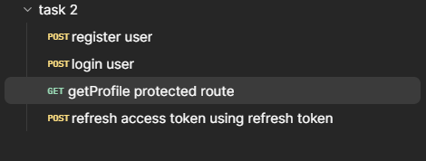
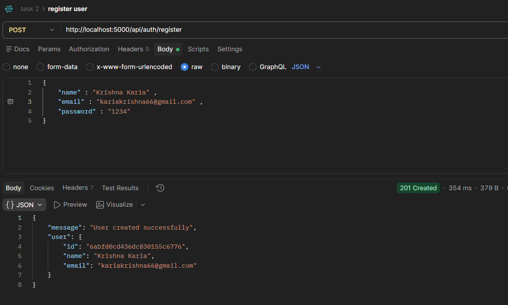
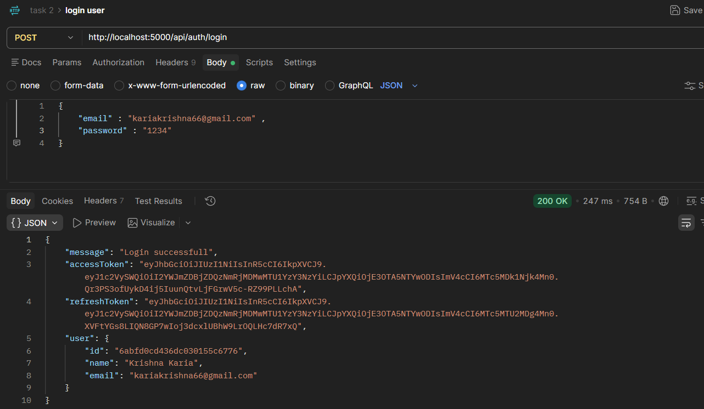
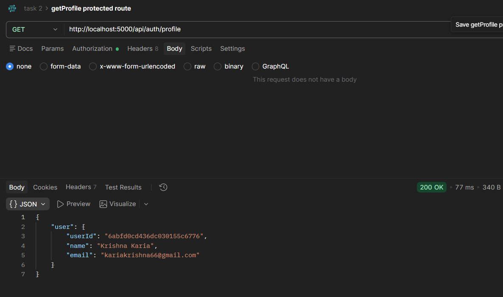
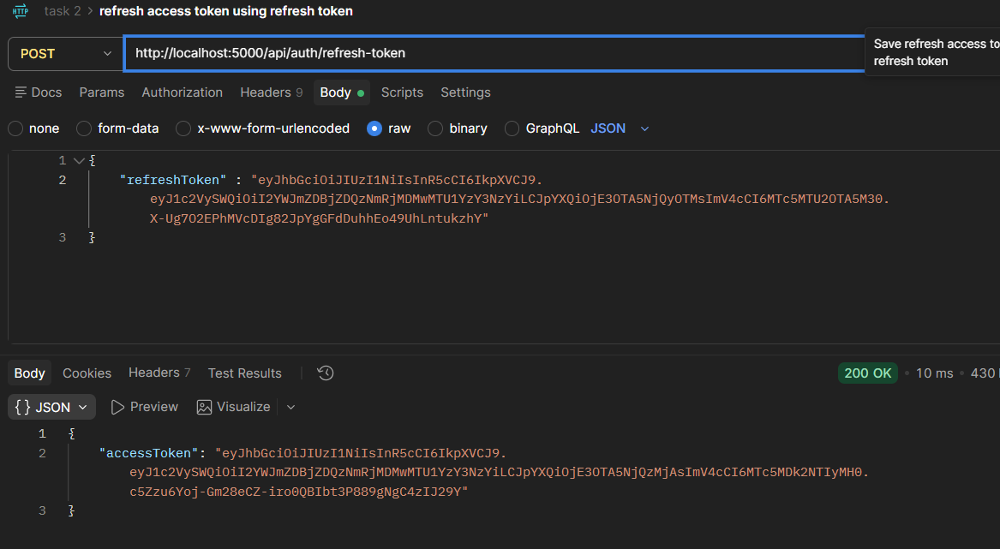
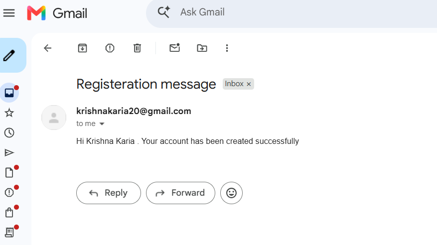
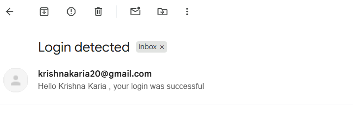

<!-- postman api testing - collection -->

<!-- register user -->

<!-- login user -->

<!-- get Profile using access token(JWT)  -->

<!-- refresh the access token using the refresh token -->

<!-- nodemailer email for registeration -->

<!-- nodemailer email for login -->

